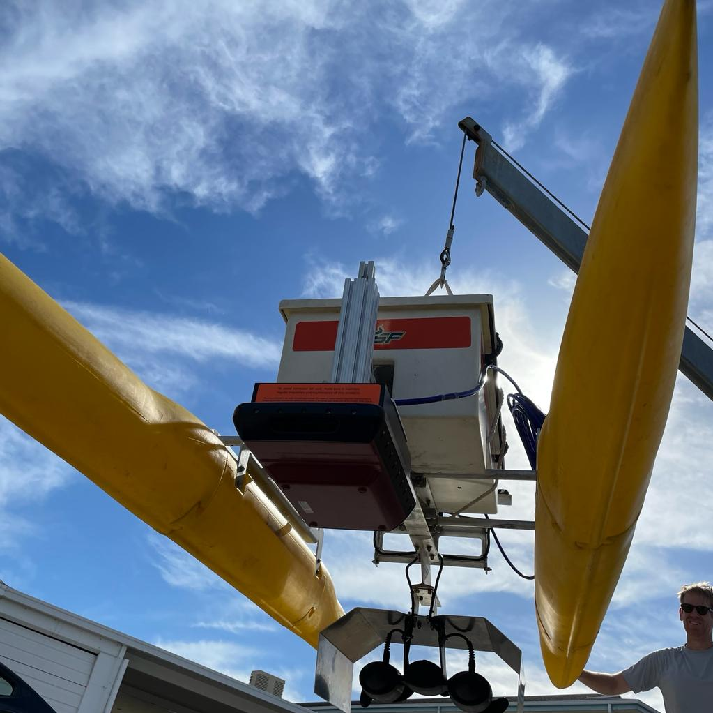

# The TREVOR ASV



## About

TREVOR (Test Robotics Environment Vehicle for Ocean Research) is a prototype modular autonomous surface vehicle.   It was developed to test unmanned data collection of various environmental and geographical data.   In particular, the design focuses on multibeam echosounder data collection and mapping.  

### Design Principles

* **Open Source**
  * Others can reproduce physical parts and software
  * Promote external collaboration or extensions
  * Well documented and reusable software
  * Collaborate with partner institutions
* **Efficient to produce at low/medium volumes**
  * Contemporary manufacturing techniques
  * 3D printing, laser cut by mail
* **Repeatable**
  * Can be produced easily with minimal tooling
  * Software can be used with minimal skill operators
* **Precise**
  * Dimensionally accurate for precise survey offsets
  * Reproducible, interchangeable parts
* **TacoMax (modular) form factor**
  * Max size for the bed of a medium pickup…such as a Toyota Tacoma


## Installation

The Trevor ASV software leverages the CCOM project 11 repository for autonomoy features.  At this time, Project 11 is only offered as a ROS1 Package   Therefore, we will need to create 2 ROS worspaces and a bridge workspace to make it work.  Fortunately, we provide you with pre-configured repositories to do this with minimal fuss!   

* let's begin by cloning the workspaces.   For this example I assume you are creating them in a `~/ros/` directory


### Get all the source code
On the control laptop...

  ```bash
  cd ~/ros
  ```
  
* the first repo we need is the [ROS2 workspace for trevor things](https://github.com/USF-COMIT/trevor_ws)
  ```bash
  git clone --recurse-submodules https://github.com/USF-COMIT/trevor_ws.git
  ```
* next let's get the [project11 related stuff](https://github.com/USF-COMIT/trevor_project11_ws)
  ```bash
  git clone --recurse-submodules https://github.com/USF-COMIT/trevor_project11_ws.git
  ```
  
* finally, grab the [project 11 bridge](https://github.com/USF-COMIT/project11_bridge) to link everything together
  ```bash
  git clone --recurse-submodules https://github.com/USF-COMIT/project11_bridge.git
  ```
  
* now get all the dependencies.   Note that because we are on foxy we need ot use a special rosdep update command
  ```bash
  rosdep update --include-eol-distros
  rosdep install --from-paths trevor_ws/src --ignore-src -r -y
  rosdep install --from-paths trevor_project11_ws/src --ignore-src -r -y
  rosdep install --from-paths project11_bridge/ros1_ws/src --ignore-src -r -y
  rosdep install --from-paths project11_bridge/ros1_ws/src --ignore-src -r -y
  ```
  

### Compile

each package has its own compile script for your convenience.   Just run each one!
```bash
~/ros/trevor_ws/build.sh
~/ros/trevor_project11_ws/build.sh
~/ros/project11_bridge/build.sh
```


### sending code to the vehicle

the code on the vehicle does not use git.   Instead, the repositories should be synced with rsync.   There is a script you can use to this in 
```bash
~/ros/trevor_ws/util/deploy.py
```

this will upload and build the code on trevor automatically for the trevor_ws. 

For the other two workspace you need to upload them manually with an rsync command like this:
```bash
rsync -ravP --exclude-from='.gitignore' --exclude '.git*' ../trevor_project11_ws  trevor@trevor1.local:~/ --delete

rsync -ravP --exclude-from='.gitignore' --exclude '.git*' ../project11_bridge  trevor@trevor1.local:~/ --delete
```

Then you must ssh into the vehicle and run the build script in the root of each workspace.   Be warned, the project11_bridge takes a long time so don't re-build unnecessarily.

## Getting Started

To begin operations start  by visiting our [operators field guide](https://usf-comit.github.io/trevor/md_docs_2operators__field__guide.html) 

For additional documentation on the hardware, electronics, and software visit our [detailed documentation ](https://usf-comit.github.io/trevor)

## Credits

This package was created by Dr. Kristopher Krasnosky and Jaden Crute of the [USF COMIT](https://github.com/USF-COMIT) group and offered under the Apache 2.0 License.

