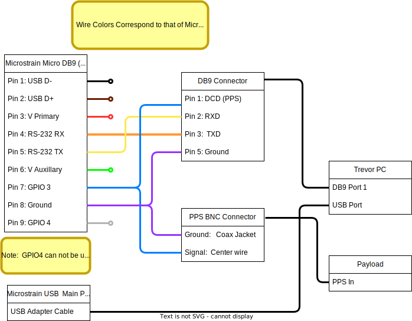
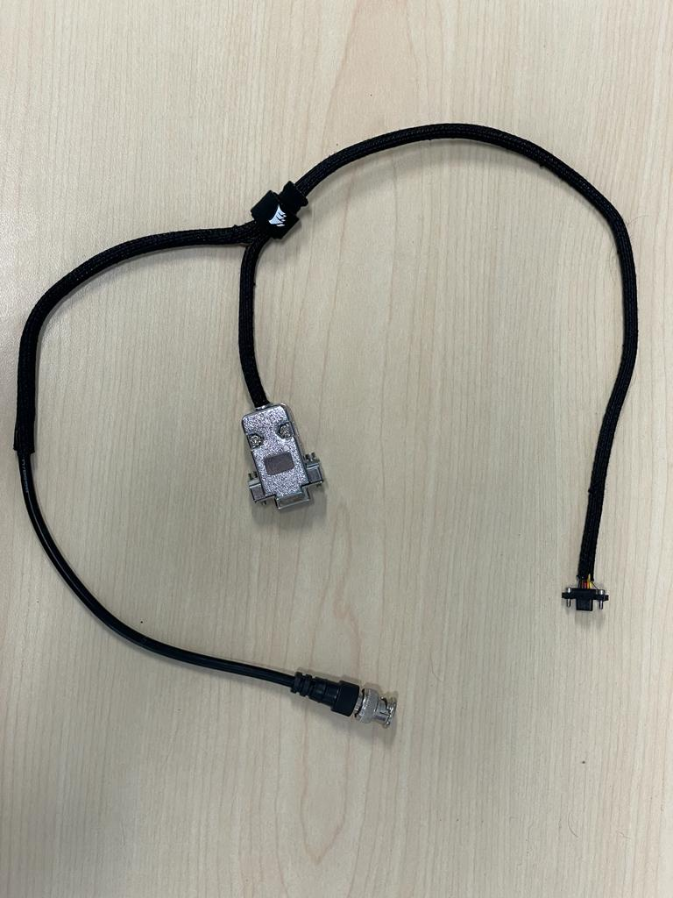

# Microstrain Configuration

## About

Trevor uses a Lord Microstrain 3DM-GQ7.  It is a fully integrated navigation solution including an RTK GPS solution with GPS heading and a full EKF filtered solution.&#x20;

* [3DM-GQ7 official documentation](https://s3.amazonaws.com/files.microstrain.com/GQ7+User+Manual/Home.htm)
* [Microstrain Inertial driver source code and documentation](https://github.com/LORD-MicroStrain/microstrain\_inertial)

## Powering

USB Power is the preferred means of powering the 3DM-GQ7 aboard TREVOR.   USB power has several advantages over direct power for our application:

* USB power is simple to wire and has minimal risk of electrical damage to the unit
* The USB connection can be used on the "MAIN" port instead of a serial connection to facilitate the maximum possible data rates.
* USB power is regulated by the device powering it.   This way the 3DM-GQ7's  will be powered on/off with the onboard computer thus preventing unnecessary uptime. &#x20;

@warning It is unsafe to power the device from multiple sources!  Do not connect 2 USB connections to different hosts (computers).   For additional details see the [**powering**](https://s3.amazonaws.com/files.microstrain.com/GQ7+User+Manual/user_manual_content/installation/Powering.htm)  **document from microstrain.**

## Wiring

* The "MAIN" port should be connected through the [USB Cable Kit for AHRS/IMU](https://www.mouser.com/ProductDetail/LORD-Microstrain/USB-Cable-Kit-for-AHRS-IMU?qs=sGAEpiMZZMv0DJfhVcWlK5aFAr7S0qM3xYSZm%252BchY8P6Mfa77UUN2A%3D%3D) directly to the onboard computer aboard TREVOR.
* The "AUX" Port should be connected through a [MICRO DB9/LEAD](https://www.mouser.com/ProductDetail/LORD-Microstrain/MICRO-DB9-LEADS?qs=sGAEpiMZZMv0DJfhVcWlK5aFAr7S0qM3tjIW1RAJLPR9gbnQxPldDg%3D%3D) using a custom MicroDB9 to DB9 with PPS breakout cable. This cable must be produced according to the schematic below.

|                                                           |
|:-------------------------------------------------------------------------------------------------:|
| *A schematic showing the complete wiring diagram for the Microstrain 3DM-GQ7 to TREVOR interface* |

|  |
|:------------------------------------------------------------------------------------:|
|               _A completed version of the microstrain interface cable_               |


## ROS2 Microstrain Inertial Driver Hardware Configuration
Below are the minimum configurations needed to physically interface with the 3DM-GQ7.   Note that this configuration does not account for any Navigation or messaging setup,  _only_ the physical hardware interface related to the wiring schematic.
```yaml
port        : /dev/ttyACM0  # main Port
aux_port    : /dev/ttyS0  # aux port for RTK corrections (assumes the DB9 port is connected to serial port 1)
baudrate    : 115200 # Baudrate to send data (Microstrain default)

gpio_config    : True

gpio3_feature  : 2  # 2 for pps
gpio3_behavior : 2  # 2 for output
gpio3_pin_mode : 0  # 0 not needed for PPS
```
