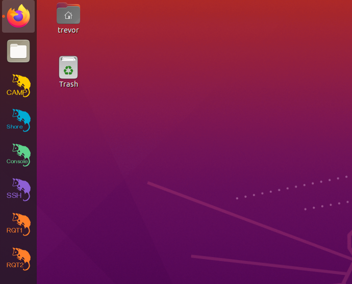

# Operator's Field Guide


## About the control system

Once installed properly,  TREVOR can be almost entirely operated using the dock icons installed on the  TREVOR laptop.  &#x20;




### A note on architecture

The trevor controller is all ROS2 Based and, at the time of writing, the PROJECT11 autonomy package (including CAMP) is ROS1 based.   This means that to run this system we need two versions of ROS running with a "ROS1 Bridge" running between them.  From an operators perspective, this shouldn't matter much.   However, for more advanced users and for system debugging this architecture is worth keeping in mind.&#x20;

## Starting The Vehicle

*   Begin by powering on the master switch located inside the  TREVOR case.

    <figure><figcaption></figcaption></figure>
* This will power on all devices and send a boot signal to the onboard computer.
*   Log into the onboard computer by clicking on the TREVOR ssh icon in the dock or through the application launcher.

    <figure><figcaption></figcaption></figure>
* run the following command&#x20;

```bash
trevor_ws/go_trevor.sh
```

* Now you can close the ssh window if you wish

## Starting the Shore Station

* Ensure that the TREVOR gamepad is plugged into the shore laptop
*   Click both the TREVOR CAMP and the TREVOR Shore icons in the dock or the application launcher

    <figure><figcaption></figcaption></figure>
*   The CAMP launcher will open a terminal and the CAMP mission planner

    <figure><figcaption></figcaption></figure>


    * The terminal contains the headless processes needed to run the shore operations and the CAMP window can be used to issue autonomous commands
    * If everything is working properly you should see a green vehicle status window.
    * The terminal may print transform warnings until the first command is issued.   This is normal and expected.
*   The TREVOR Shore icon will launch the joystick controller in a terminal and an instance of RVIZ to show a 3d view of the vehicle.   The RVIZ window can be closed safely if desired to reduce network bandwidth and save GPU resources.

    <figure><figcaption></figcaption></figure>
* At this point, the vehicle is ready to operate!

## Operating the vehicle

* The vehicle begins in the e-stop state by default.   To activate the thrusters press the green "A" button on the controller.   This will activate manual control
* You can set a thrust limit by using the D-pad.    This can me useful for precise manuevering or for testing.   It applies to autonomous and manual control.&#x20;
  * Up: 100% thrust limit
  * Left: 60% thrust limit
  * Down: 25% thrust limit
* To begin autonomy, you can issue a move command by right clicking on the map and selecting goto or hold position.&#x20;
*   A trajectory will be drawn on the map ONLY after the command has been acknowledge by the vehicle

    <figure><figcaption></figcaption></figure>
* &#x20;(for some reason sometimes the first command needs to be issued a few times)
* Once the command is issued and acknowledge you can press the BLUE X button on the controller.   This will activate autonomous mode.    The vehicle will begin traversing to the desired location.  It should hold position when it arrives.

Although we don't cover it here, CAMP can plan many other types of commands.  You can find more details here:  [https://github.com/CCOMJHC/project11](https://github.com/CCOMJHC/project11)

## Advanced Features and  Debugging.&#x20;

### The Trevor Console

By clicking the TREVOR Console icon you can open the admin features of the onboard computer.&#x20;

<figure><figcaption></figcaption></figure>

Using this window, you can change network configuration, look at the file system, upload/download files, and more.   You can also use the terminal tab as an alternative to SSH access.

### File Sharing

If you want to download logs or look through the filesystem you can access TREVOR's home directory using the built in SMB server.   It is pre-configured on the TREVOR  control laptop.  &#x20;

You can access it by opening the file browser, clicking other locations, and clicking the TREVOR1 Network drive.

<figure><figcaption></figcaption></figure>

### ROS Tools and Debugging

You can open a version of ROS 1 or 2 RQT GUI using the icons at the left.   These tools allow you to see logs, read raw ROS messages, and check the status of instruments.

#### Checking the status of the microstrain.

* click the TREVOR RQT2 Icon
* select the plugins tab >  microstrain > quickview (if not already open)
* in the node namespace enter

```
 /t1/nav/sensors/

```

* Click OK

<figure><figcaption></figcaption></figure>

Here you can see the status of the Microstrain Nav Sensor
