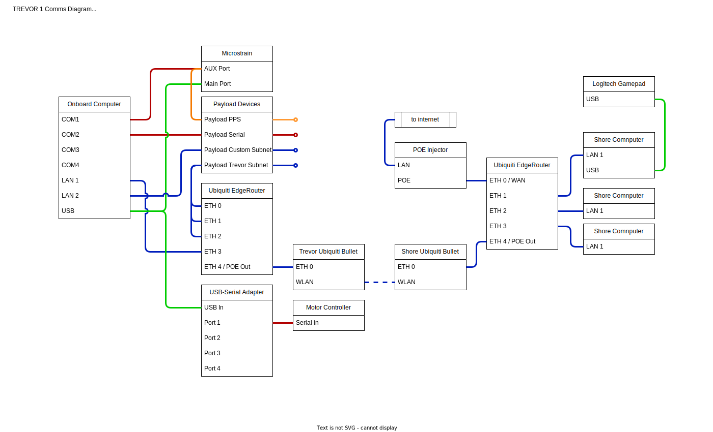
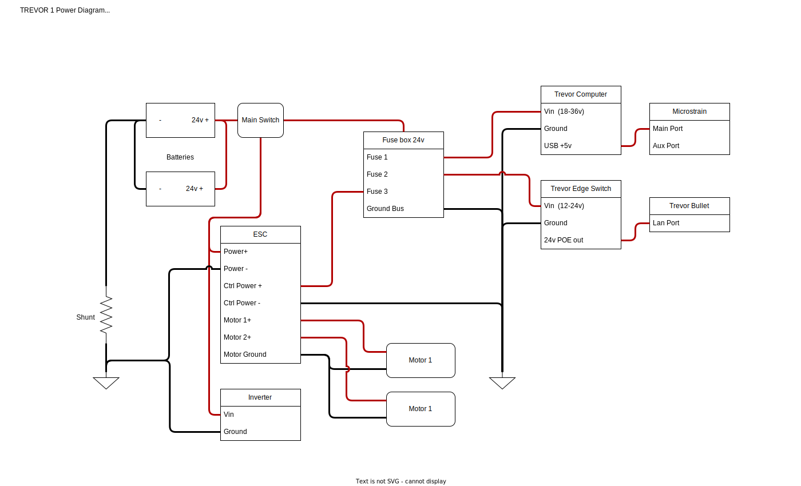
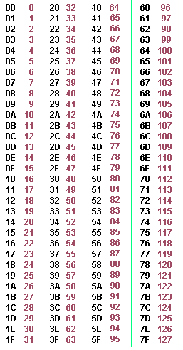
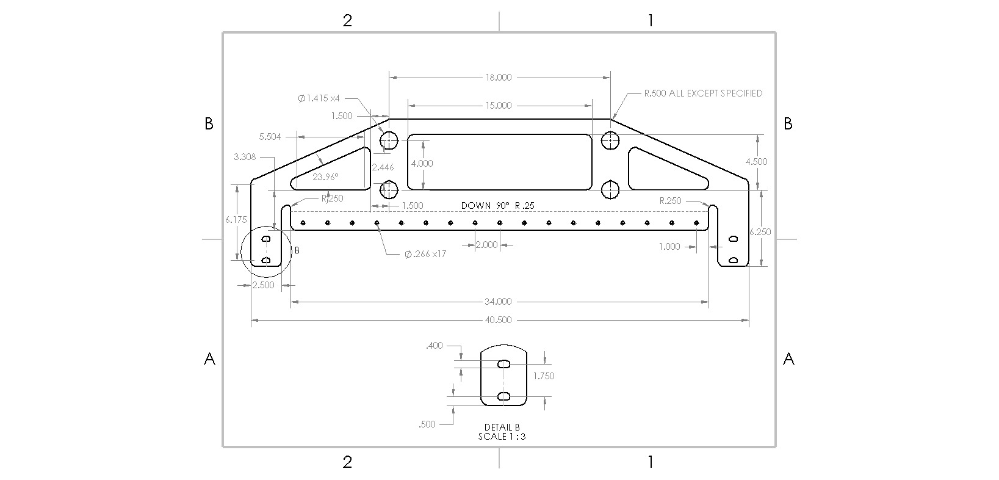
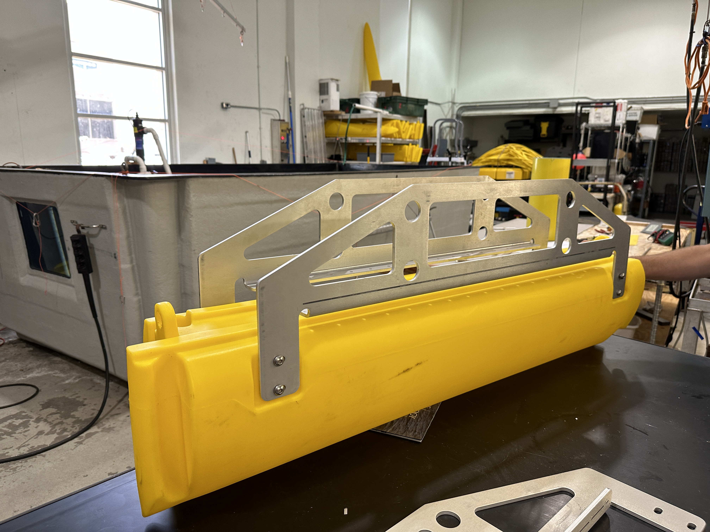
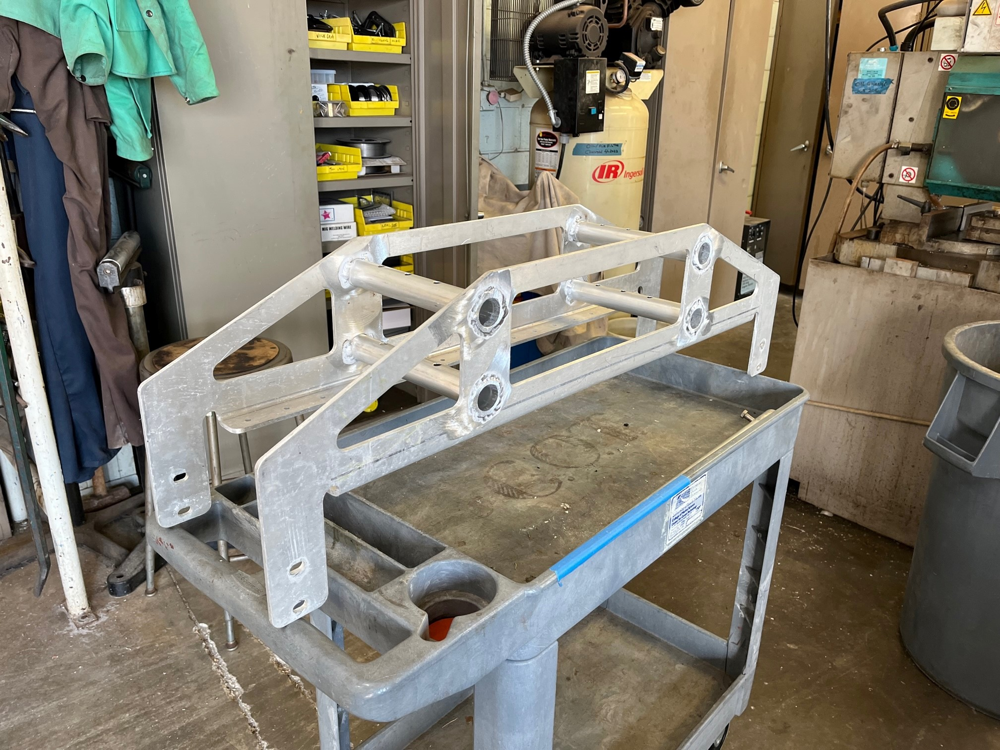
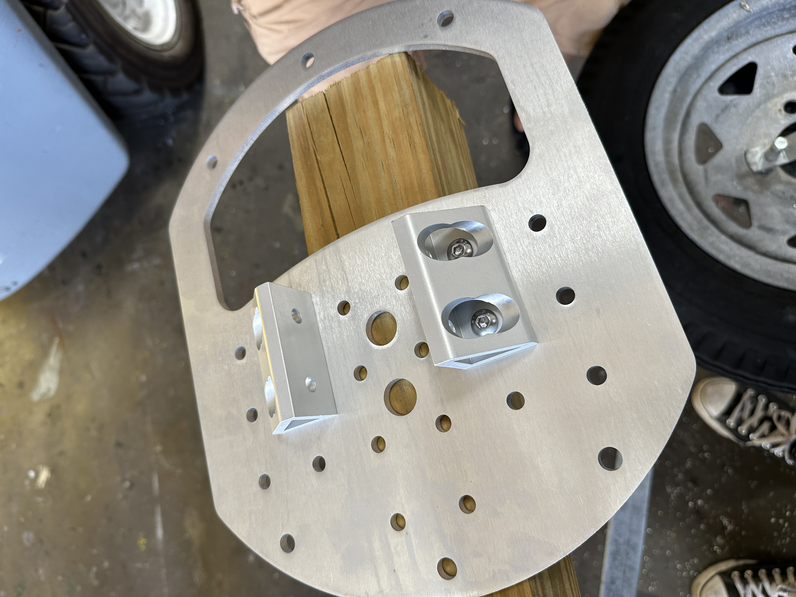
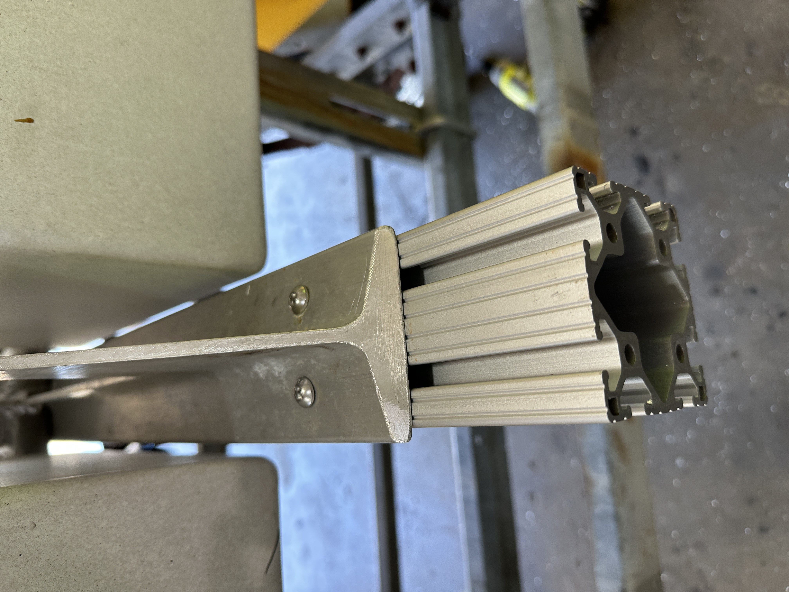
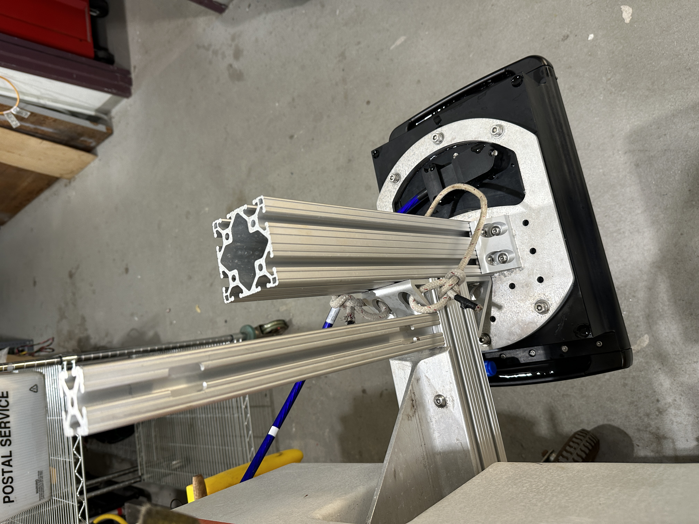
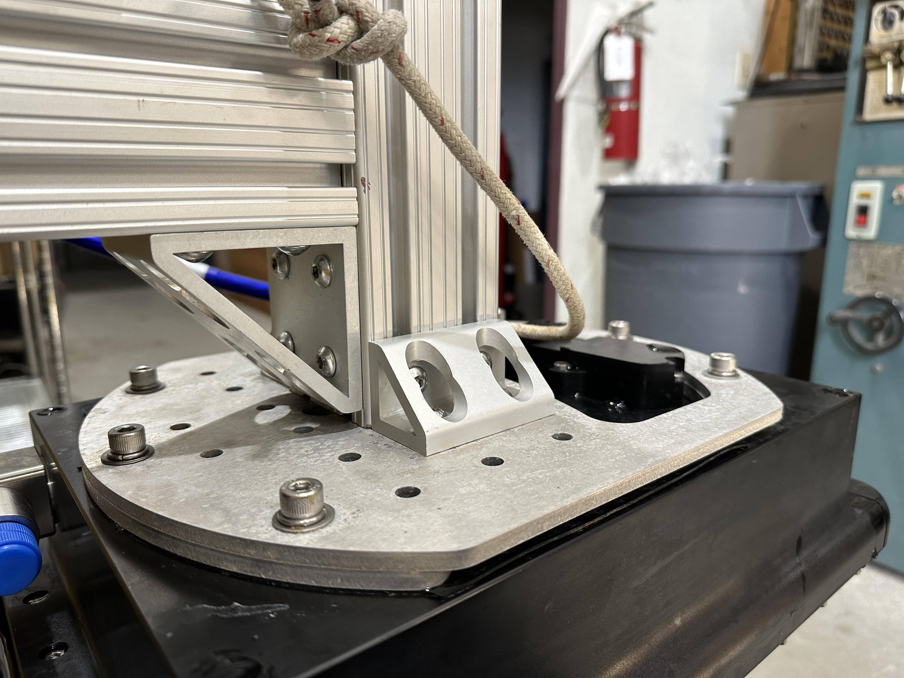

# TREVOR Hardware Systems Description

## Communications schematic

## Power Schematic

## Onboard Computer
 The onboard computer is a Premio Fanless mini pc part no:  RCO-1000-EHL-J6413-20-P.   It is running ubuntu 20.04 with ROS1 Noetic and ROS2 Foxy.
 
The full configuration can be found here:  [Premio Edge PC configuration](media/premio_description.pdf)

NOTE:   at this time we have not been able to communicate through COM3 and COM4.   As a temporary fix we have been using a USB-Serial adapter for additional serial ports.

## Navigation

The navigation system used is the Microstrain 3DM-GQ7.  This device requires some custom wiring not fully described in the diagram above.   Please see the [Microstrain Configuration](microstrain_configuration.md) page for details.

## Shore Station

The shore station consists of Ubiquiti Bullet, an Edge Router, a Field Laptop, and a Logitech gamepad.  Additional PCs or devices may be connected to ports ETH 2 and ETH 3 on the shore EdgeRoutter.

## Network

**The network devices used are:** 
* [Ubiquiti Edge Rounter x (2)](https://store.ui.com/us/en/products/er-x)
* [Ubiquiti airMAX Bullet AC IP67 (2)](https://store.ui.com/us/en/pro/category/all-wireless/products/bulletac-ip67)

**The devices are configured as follows:**

* The shore Edge Router is currently configured as a gateway and administers DHCP
  * This device maps static IPs to all the devices on the system
* The TREVOR Edge Router is in switch mode with POE out turned on for port 4
* The Shore Bullet is in bridge mode and is functioning as the access point for the WLAN
* The TREVOR Bullet is also in bridge mode and functions as a client

## Motor Controller

The motor controller found on the vehicle is manufactured by Roboteq. **The operators manual can be found here:**
[Motor Controller Manual](media/Motor%20Controller%20Users%20Manual.pdf)

The syntax required for communication with the motor controller can be found in the user manual and is sumarized as follows:

**Syntax: !Mnn**
  * Where M=
    * A: channel 1, forward direction
    * a: channel 1, reverse direction
    * B: channel 2, forward direction
    * b: channel 2, reverse direction
  * Where nn= Speed or position value   in 2 Hexadecimal digits from 00 to 7F (0 to 127 in decimal). Refer to the image below for direct converssions between hexadecimal and decimal.

Examples of correctly formatted commands are:
* Motor 1 100% power forward: !A7F
* Motor 2 50% power backward: !b3F

## Batteries

## Hulls and Mounts

The mounts were sent to a third-party manufacturer called SendCutSend. **Find the DXF file that can be submitted here:**
[DXF](media/Flat%20Truss%20Mount%20Manufacture.DXF)

If you wish to modify or rebuild the part, find a 3D PDF and drawing screenshot below:
[3D PDF](media/Truss%20Mount%20Manufactured.PDF)

The mounts were manufactured out of 0.25" 5052 Aluminium. 

The following parts were ordered from McMaster Carr for use as fasteners:

| Part Name     | Quantity                  | Link                                                     |
|---------------|---------------------------|----------------------------------------------------------|
| 6061 Al Pipes | ~1 per mount, cut to size | [McMaster](https://www.mcmaster.com/89965K411-89965K413) |
| Bolts         | 4 per mount               |                                                          |
| Lock Washers  | 4 per mount               |                                                          |

The pipes were cut to length and welded into place. These attatch the hulls to the vehicle.

## Multibeam Sonar Mount

The entire multibeam mounting system consists of a mounting plate and a series of 8020 rails/brackets. This system was mounted to the lower I-beam structure of the USV.

The mount plate was designed in SolidWorks and manufactured by SendCutSend, a third-party manufacturer. 
